# 👋 Hi there, I'm **Vignesh BABU T R**

<div align="center">

[](https://git.io/typing-svg)

<br/>

<!-- Animated wave -->


**Welcome to my digital universe!** 🌟

[](https://github.com/VICKY-0017)
[](https://github.com/VICKY-0017)
[](https://github.com/VICKY-0017)

</div>

---

<div align="center">

### 🎯 **About Me**

```javascript
const vignesh = {
    location: "Tamil Nadu, India 🇮🇳",
    education: "Computer Science Engineering - Final Year",
    specializations: ["Full-Stack Development", "AI/ML", "Data Science"],
    currentFocus: ["Generative AI", "LLM Integration", "Voice AI", "Automation"],
    workStyle: ["Problem Solver", "Innovation Driven", "Client Focused"],
    availableFor: ["Full-time Opportunities", "Freelance Projects", "Collaborations"]
};
```

</div>

---

## 🛠️ **Tech Arsenal**

<div align="center">

### **💻 Programming Languages**


### **🚀 Frameworks & Libraries**


### **🗄️ Databases & Tools**


### **📊 Analytics & Visualization**


</div>

---

## 🏆 **Featured Projects**

<div align="center">

| Project | Description | Tech Stack | Status |
|---------|-------------|------------|--------|
| **🌱 [Earthiest](https://github.com/VICKY-0017/Earthiest)** | AI-powered tree plantation verification with image recognition and reward system | Python, TensorFlow, OpenCV | ✅ Live |
| **📧 [GenAI Email Generator](https://github.com/VICKY-0017/Email_generator-GenAI--main)** | Smart LLM-powered email writing tool for rapid contextual responses | Python, LLM APIs, Streamlit | ✅ Live |
| **💰 [Investment Analysis Bot](https://github.com/VICKY-0017/Invesment_Analysis_Bot)** | Financial trends analysis with data-driven insights | Python, ML, Data Analytics | ✅ Live |
| **🚶‍♀️ [Pedestrian Detection](https://github.com/VICKY-0017/Pedestrian_Detection_ML_Model)** | Real-time pedestrian detection system | OpenCV, TensorFlow, Python | ✅ Live |

</div>

---

## 💼 **Professional Experience**

### 🌟 **Freelance Full-Stack Developer** | *Fiverr*

**📚 Spoken English E-learning Platform** - *MERN Stack Project*

<div align="center">

| Feature | Technology | Impact |
|---------|------------|--------|
| 🎛️ **Teacher Dashboard** | React.js, Node.js | Complete analytics & content management |
| 🎓 **Student Portal** | MongoDB, Express.js | Interactive lessons & progress tracking |
| 🤖 **AI Chatbot** | NLP, Real-time API | 24/7 conversation practice & doubt resolution |
| 📊 **Analytics** | Chart.js, Data Visualization | Performance insights & reporting |
| 🔐 **Security** | JWT, Role-based Access | Secure authentication system |

**Result:** ⭐⭐⭐⭐⭐ **5-Star Client Rating** | **100% Project Success**

</div>

---

## 🚀 **Current Focus Areas**

```mermaid
mindmap
  root((Vignesh's Tech Journey))
    🤖 AI/ML
      Generative AI
      LLM Integration
      Voice AI Systems
      Computer Vision
    💻 Development
      MERN Stack
      API Development
      Database Design
      UI/UX Implementation
    🔧 Automation
      Process Automation
      Web Scraping
      Data Pipelines
      Deployment Tools
    🌱 Innovation
      Sustainability Tech
      Social Impact Projects
      Open Source Contribution
      Research & Development
```

<div align="center">



</div>

**Currently Building:**
- 🔁 **Agentic AI Systems** using Google GenAI Processors
- 🎙️ **Voice AI Assistants** with advanced automation pipelines
- 🔧 **Real-world AI Deployment** solutions with Flask & Selenium
- 🌐 **Full-stack AI Platforms** for business automation

---

## 🎯 **Open for Collaboration**

<div align="center">

| 🔍 **Looking For** | 💡 **Can Contribute** |
|-------------------|----------------------|
| Full-time SDE Roles | MERN Stack Development |
| AI/ML Engineering Positions | GenAI Integration |
| Freelance Projects | Data Science Solutions |
| Open Source Contributions | Automation Tools |
| Startup Opportunities | Technical Leadership |

</div>

---

## 🌐 **Connect & Collaborate**

<div align="center">

[](https://portfolio-yj8s.onrender.com)
[](https://linkedin.com/in/vignesh-babu-t-r-880880250)
[](mailto:t.r.vigneshbabu1@gmail.com)

</div>

---

## 🏅 **Competitive Programming**

<div align="center">

[](https://www.hackerrank.com/profile/t_r_vigneshbabu1)
[](https://leetcode.com/vicky_3110/)

### 📈 **LeetCode Performance**
[](https://leetcode.com/vicky_3110/)

</div>

---

## 📊 **GitHub Analytics**

<div align="center">

<table>
  <tr>
    <td align="center">
      
    </td>
    <td align="center">
      
    </td>
  </tr>
</table>


### 🏆 **GitHub Trophies**


</div>

---

## 🌟 **What Sets Me Apart**

<div align="center">

| 💪 **Strengths** | 🎯 **Values** | 🚀 **Goals** |
|------------------|---------------|--------------|
| ✅ Full-Stack + AI Expertise | 🤝 Client-First Approach | 🌱 Build Sustainable Tech |
| ✅ Rapid Prototyping | 💡 Innovation Mindset | 🔧 Master Emerging Technologies |
| ✅ Problem-Solving Focus | 📈 Continuous Learning | 🤖 Pioneer AI Solutions |
| ✅ Team Collaboration | 🎯 Quality Delivery | 🌍 Create Global Impact |

</div>

---

<div align="center">

### 💭 **Philosophy**

> *"Code is poetry, AI is magic, and together they create solutions that matter."*

**🚀 Ready to build the future? Let's connect!**

---


</div>
