# 👋 Hi there, I'm **Vignesh BABU T R**

<div align="center">

[](https://git.io/typing-svg)

<br/>

<!-- Animated wave -->


**Welcome to my digital universe!** 🌟

[](https://github.com/VICKY-0017)
[](https://github.com/VICKY-0017)
[](https://github.com/VICKY-0017)

</div>

---

<div align="center">

### 🎯 **About Me**

```javascript
const vignesh = {
    location: "Tamil Nadu, India 🇮🇳",
    education: "Computer Science Engineering - Final Year",
    specializations: ["Full-Stack Development", "AI/ML", "Data Science"],
    currentFocus: ["Generative AI", "LLM Integration", "Voice AI", "Automation"],
    workStyle: ["Problem Solver", "Innovation Driven", "Client Focused"],
    availableFor: ["Full-time Opportunities", "Freelance Projects", "Collaborations"]
};
```

</div>

---

## 🛠️ **Tech Arsenal**

<div align="center">

**Core Languages**

<div align="center">
<table>
<tr>
<td align="center" width="120">

<br><strong>Java</strong>
</td>
<td align="center" width="120">

<br><strong>Python</strong>
</td>
<td align="center" width="120">

<br><strong>HTML5</strong>
</td>
<td align="center" width="120">

<br><strong>CSS3</strong>
</td>
</tr>
</table>
</div>

<br>

 **Frameworks & Libraries**

<div align="center">
<table>
<tr>
<td align="center" width="120">

<br><strong>React.js</strong>
</td>
<td align="center" width="120">

<br><strong>Node.js</strong>
</td>
<td align="center" width="120">

<br><strong>Express.js</strong>
</td>
</tr>
</table>
</div>
<br>

 **Databases**

<div align="center">
<table>
<tr>
<td align="center" width="120">

<br><strong>MongoDB</strong>
</td>
<td align="center" width="120">

<br><strong>MySQL</strong>
</td>
<td align="center" width="120">

<br><strong>SQL</strong>
</td>
<td align="center" width="120">

<br><strong>Pandas</strong>
</td>
</tr>
</table>
</div>
<br>

 **Data Visualization**

<div align="center">
<table>
<tr>
<td align="center" width="120">

<br><strong>Power BI</strong>
</td>
<td align="center" width="120">

<br><strong>Tableau</strong>
</td>
</tr>
</table>
</div>

<br>

 **AI/ML & Computer Vision**

<div align="center">
<table>
<tr>
<td align="center" width="120">

<br><strong>OpenCV</strong>
</td>
<td align="center" width="120">

<br><strong>TensorFlow</strong>
</td>
<td align="center" width="120">

<br><strong>Keras</strong>
</td>
</tr>
</table>
</div>

<br>


</div>

---

### 🚀 Featured Projects

[](https://github.com/VICKY-0017/Earthiest)  
🌿 **Earthiest** — AI-powered tree plantation verification with image recognition and a reward system.

[](https://github.com/VICKY-0017/Email_generator-GenAI--main)  
🤖 **GenAI Email Generator** — Smart LLM-powered email writing tool for rapid and contextual responses.

[](https://github.com/VICKY-0017/Invesment_Analysis_Bot)  
📊 **Investment Analysis Bot** — Python tool for analyzing financial trends and offering data-driven insights.

[](https://github.com/VICKY-0017/Pedestrian_Detection_ML_Model)  
🚸 **Pedestrian Detection** — Real-time pedestrian detection using OpenCV and TensorFlow.


---

## 💼 **Professional Experience**

### 🌟 **Freelance Full-Stack Developer** | *Fiverr*

**📚 Spoken English E-learning Platform** - *MERN Stack Project*

<div align="center">

| Feature | Technology | Impact |
|---------|------------|--------|
| 🎛️ **Teacher Dashboard** | React.js, Node.js | Complete analytics & content management |
| 🎓 **Student Portal** | MongoDB, Express.js | Interactive lessons & progress tracking |
| 🤖 **AI Chatbot** | NLP, Real-time API | 24/7 conversation practice & doubt resolution |
| 📊 **Analytics** | Chart.js, Data Visualization | Performance insights & reporting |
| 🔐 **Security** | JWT, Role-based Access | Secure authentication system |

**Result:** ⭐⭐⭐⭐⭐ **5-Star Client Rating** | **100% Project Success**

</div>

---

## 🚀 **Current Focus Areas**

```mermaid
mindmap
  root((Vignesh's Tech Journey))
    🤖 AI/ML
      Generative AI
      LLM Integration
      Voice AI Systems
      Computer Vision
    💻 Development
      MERN Stack
      API Development
      Database Design
      UI/UX Implementation
    🔧 Automation
      Process Automation
      Web Scraping
      Data Pipelines
      Deployment Tools
    🌱 Innovation
      Sustainability Tech
      Social Impact Projects
      Open Source Contribution
      Research & Development
```

<div align="center">



</div>

### 🎯 **Currently Building & Exploring**

<div align="center">

| 🔥 **Active Projects** | 🛠️ **Technologies** | 📈 **Impact** |
|------------------------|---------------------|---------------|
| 🔠**Agentic AI Systems** |   | Intelligent automation workflows |
| 🎙️ **Voice AI Assistants** |   | Natural language interfaces |
| 🔧 **AI Deployment Solutions** |   | Production-ready AI systems |
| 🌠**Full-stack AI Platforms** |   | Business automation solutions |

</div>

---

## 🎯 **Open for Collaboration**

<div align="center">

### 🔍 **What I'm Looking For**

<table>
<tr>
<td align="center" width="200">

<br><strong>Full-time SDE Roles</strong>
<br><small>Ready to contribute to innovative teams</small>
</td>
<td align="center" width="200">

<br><strong>AI/ML Engineering</strong>
<br><small>Building next-gen AI solutions</small>
</td>
<td align="center" width="200">

<br><strong>Freelance Projects</strong>
<br><small>Custom development solutions</small>
</td>
</tr>
<tr>
<td align="center" width="200">

<br><strong>Open Source</strong>
<br><small>Contributing to community projects</small>
</td>
<td align="center" width="200">

<br><strong>Startup Opportunities</strong>
<br><small>Early-stage innovation ventures</small>
</td>
<td align="center" width="200">

<br><strong>Tech Mentorship</strong>
<br><small>Sharing knowledge & learning</small>
</td>
</tr>
</table>

### 💡 **What I Bring to the Table**


</div>

---

## 🌐 **Connect & Collaborate**

<div align="center">

### 📬 **Let's Build Something Amazing Together**

<table>
<tr>
<td align="center" width="250">
<a href="https://portfolio-yj8s.onrender.com" target="_blank">

<br><br>

</a>
<br><small><em>Explore my projects & case studies</em></small>
</td>
<td align="center" width="250">
<a href="https://linkedin.com/in/vignesh-babu-t-r-880880250" target="_blank">

<br><br>

</a>
<br><small><em>Connect for opportunities & networking</em></small>
</td>
<td align="center" width="250">
<a href="mailto:t.r.vigneshbabu1@gmail.com" target="_blank">

<br><br>

</a>
<br><small><em>Direct communication for projects</em></small>
</td>
</tr>
</table>

### 🚀 **Quick Response Guarantee**

<div align="center">

| 📧 **Email** | 💼 **LinkedIn** | 🌐 **Portfolio** |
|-------------|----------------|------------------|
| ⚡ **< 24 hours** | ⚡ **< 48 hours** | 🔄 **Always Updated** |
| Project inquiries | Professional networking | Latest work showcase |

</div>

<br>

**🎯 Currently accepting:** *Freelance Projects* • *Full-time Opportunities* • *Collaboration Invites*

**🌟 Expertise available for:** *MERN Development* • *AI Integration* • *Data Solutions* • *Process Automation*

</div>

## 🏅 **Competitive Programming**

<div align="center">

[](https://www.hackerrank.com/profile/t_r_vigneshbabu1)
[](https://leetcode.com/vicky_3110/)

### 📈 **LeetCode Performance**
[](https://leetcode.com/vicky_3110/)

</div>

---

## 📊 **GitHub Analytics**

<div align="center">

<table>
  <tr>
    <td align="center">
      
    </td>
    <td align="center">
      
    </td>
  </tr>
</table>


### 🏆 **GitHub Trophies**


</div>

---

## 🌟 **What Sets Me Apart**

<div align="center">

| 💪 **Strengths** | 🎯 **Values** | 🚀 **Goals** |
|------------------|---------------|--------------|
| ✅ Full-Stack + AI Expertise | 🤝 Client-First Approach | 🌱 Build Sustainable Tech |
| ✅ Rapid Prototyping | 💡 Innovation Mindset | 🔧 Master Emerging Technologies |
| ✅ Problem-Solving Focus | 📈 Continuous Learning | 🤖 Pioneer AI Solutions |
| ✅ Team Collaboration | 🎯 Quality Delivery | 🌍 Create Global Impact |

</div>

---

<div align="center">

### 💭 **Philosophy**

> *"Code is poetry, AI is magic, and together they create solutions that matter."*

**🚀 Ready to build the future? Let's connect!**

---


</div>
